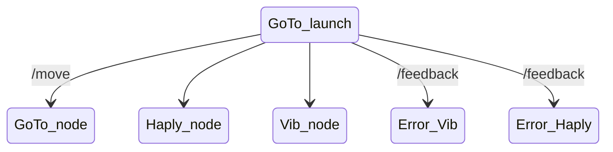

# Faire de jolis diagrammes avec Mermaid

Tuto pour le mettre en place : https://sphinxcontrib-mermaid-demo.readthedocs.io/en/latest/

```mermaid
stateDiagram-v2

	GoTo_launch --> GoTo_node : /move
	GoTo_launch --> Haply_node
	GoTo_launch --> Vib_node
	GoTo_launch --> Error_Vib : /feedback
	GoTo_launch --> Error_Haply : /feedback
```