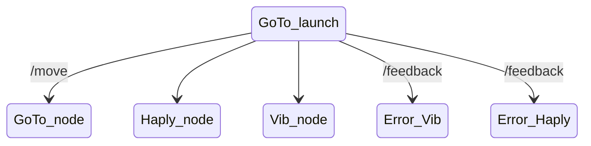

# Faire de jolis diagrammes avec Mermaid

Tuto pour le mettre en place : https://sphinxcontrib-mermaid-demo.readthedocs.io/en/latest/$

J'ai pas réussi à obtenir ce que je veux en suivant ce tuto.

Qu'est-ce que ça donne avec celui-ci ? https://mariocarrion.com/2019/08/04/gitlab-mkdocs-mermaid-pages.html

.. mermaid::

   sequenceDiagram
      participant Alice
      participant Bob
      Alice->John: Hello John, how are you?
      loop Healthcheck
          John->John: Fight against hypochondria
      end
      Note right of John: Rational thoughts  prevail...
      John-->Alice: Great!
      John->Bob: How about you?
      Bob-->John: Jolly good!

