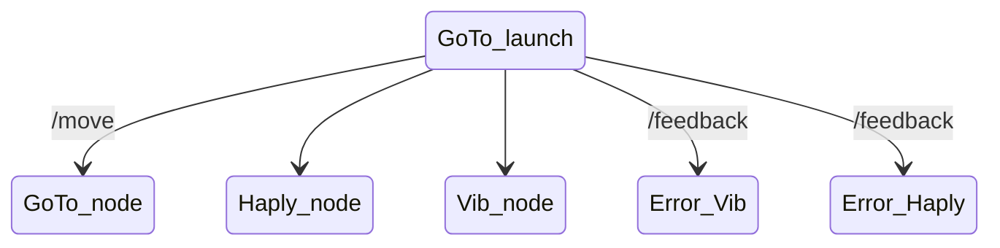

# Comment générer la documentation ?

1. Il faut mettre en place un *pipe* d'intégration continue : fichier `.gitlab-ci.yml`.

Mermaid example : https://github.com/mgaitan/sphinxcontrib-mermaid




```{discussion} This lesson is built with Sphinx
Try to compare the [source
code](https://raw.githubusercontent.com/coderefinery/documentation/main/content/sphinx.md)
and the result side by side.
```

Our goal in this episode is to build HTML pages locally on our computers.

````{prereq} Before we start, let us verify whether we have the software we need

  You may need to activate your CodeRefinery conda environment we set up
  in the installation instructions.  This was covered as part of the
  installation instructions, but the most usual command to do this is:
  ```console
  $ conda activate coderefinery
  ```

  Check whether Python is available
  (you should see a version; precise version is not so important):
  ```console
  $ python --version

  Python 3.11.5
  ```

  Check whether Sphinx is available
  (you should see a version; precise version is not so important):
  ```console
  $ sphinx-build --version

  sphinx-build 5.3.0
  ```

  Check whether the quickstart tool is available
  (you should see a version; precise version is not so important):
  ```console
  $ sphinx-quickstart --version

  sphinx-quickstart 5.3.0
  ```

  Check whether MyST parser is available
  (you should see no output):
  ```console
  $ python -c "import myst_parser"
  ```

If the above commands produce an error
(**command not found** or **module not found** or **ModuleNotFoundError**),
please follow our
[installation instructions](https://coderefinery.github.io/installation/conda-environment/).
But please don't give up if you don't have these - the episodes after this one will work even without these
tools.
````

Puis faire la configuration de Sphinx : `conf.py`, `Makefile` et `make.bat` (tout ça provient de la documentation de Sphinx)

2. Créer des fichiers dans lesquels on écrit notre belle documentation : dans `content`.

    - Titre de niveau 1 `# Titre de niveau 1` dans chaque fichier Markdown pour que ça s'affiche sur le côté.

3. Ajouter tous ces fichiers dans l'index.

    