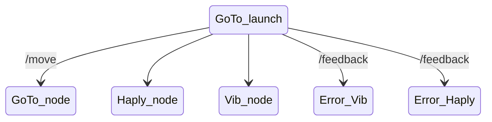

# Comment générer la documentation ?

1. Il faut mettre en place un *pipe* d'intégration continue : fichier `.gitlab-ci.yml`.

Puis faire la configuration de Sphinx : `conf.py`, `Makefile` et `make.bat` (tout ça provient de la documentation de Sphinx)

2. Créer des fichiers dans lesquels on écrit notre belle documentation : dans `content`.

    - Titre de niveau 1 `# Titre de niveau 1` dans chaque fichier Markdown pour que ça s'affiche sur le côté.

3. Ajouter tous ces fichiers dans l'index.

    